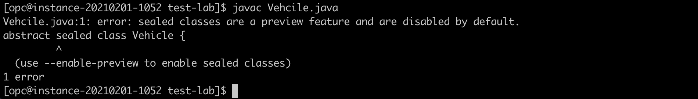

# Lab 4: Java SE Preview Features

## Overview


This  5-minutes lab will give you an introduction to the Java SE **Preview Feature** mechanism.

The Preview Feature mechanism enables to add non-final, fully specified, and implemented features into the Java platform. The goal is to allow developers to use those non-final features, to gather feedback, and to make necessary changes if needed before those features are made final and permanent into the Java platform.

⚠️ **Preview Features** should not be confused with **Experimental Features** or with **Incubator Modules**. For more information, please check this [article](https://blogs.oracle.com/javamagazine/the-role-of-previews-in-java-14-java-15-java-16-and-beyond). 


## Hello Preview 


1. Create a sealed classes hierarchy

In a new directory, create a simple _Vehicle.java_ abstract class with 2 auxiliary classes in it, _Car_ and _Bike_:

```
<copy>
nano Vehicle.java
</copy>
```

```java
<copy>
abstract sealed class Vehicle {

}

final class Car extends Vehicle {

}

final class Bike extends Vehicle {

}
</copy>
```

⚠️ This example uses the Sealed class feature (see Lab 8) to define a basic sealed classes hierarchy, its sole purpose is to introduce the concept of Preview Feature.

2. Compile it

```
<copy>
javac Vehicle.java
</copy>
```




 This error simply informs you that you are trying to use the Sealed class feature which is a preview feature in Java 16, and that those are disabled by default. To use preview features, you need to explicitly enable them, at compile-time, using the `--enable-preview` flag. Note that, you also need to confirm to the Java compiler which version of the Preview Feature you are using (ex. using the `--release` flag). 

```
<copy>
javac --enable-preview --release 16 Vehicle.java
</copy>
```

Those 2 flags are enforcing a safeguard mechanism that informs you that non-permanent features are used, and hence those might change in a future Java release.


The compilation now succeeds. Notice that you are still warned that preview features are used in the code.

To run code that uses Preview Feature, you would face the same safeguard as Preview Features are also disabled at runtime! To be used, they should be explicitly enabled using the `--enable-preview` flag. The difference is that at runtime, you don't need to use a flag to confirm the version that you are using.

```
java --enable-preview SomePreviewTest
```

💡 Running this particular example doesn't make sense as it is empty.

## Preview Features & Helidon

Likewise, to use a Preview Feature in Helidon, those should be enabled at both compile-time and runtime.

#### Compile-time configuration

In an Helidon project's `pom.xml`, configure the Java compiler plugin to Java 16 **and** to enable Preview Features.

```xml
<copy>
<plugins>
   …
   <plugin>
      <groupId>org.apache.maven.plugins</groupId>
      <artifactId>maven-compiler-plugin</artifactId>
      <version>3.8.0</version>
      <configuration>
        <release>16</release>
        <compilerArgs>--enable-preview</compilerArgs>
      </configuration>
   </plugin>
</plugins>
</copy>
```
#### Runtime configuration

To run the application, use the following command.

```
<copy>
java --enable-preview -jar target/myapp.jar
</copy>
```

Similarly, to use Preview Features via the Helidon CLI 'devloop', you need to pass the same `--enable-preview` argument to the JVM running the application:

```
<copy>
helidon dev --app-jvm-args "--enable-preview"
</copy>
```

⚠️ If during this lab, Helidon hangs while starting ('devloop'), double-check that you have effectively enabled preview features! 


## Wrap-up

In this section, you have used Sealed Classes, a Preview Feature in Java 16. You have also seen how to enable Preview Features in Helidon applications.

In summary, the **Preview Feature** mechanism:
* allows introducing non-final features into the Java platform (ex. Language Feature)
* allow developers to use those and provide feedback
* enables Oracle to gather that feedback and make changes if needed
* Preview Features are disabled by default, they should explicitly be enabled at both compile-time and runtime
* a given Preview Feature is specific to a specific Java version

<br>
💡 Java 16 includes Sealed Classes (JEP 397 - Second Preview), a **Preview Feature** that will be discussed in an upcoming section.


 
