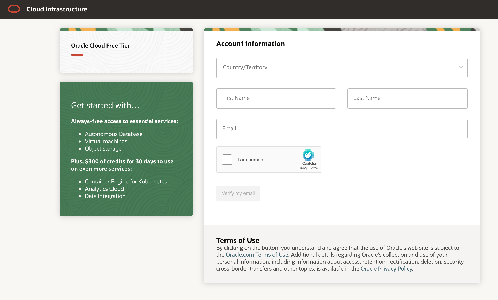
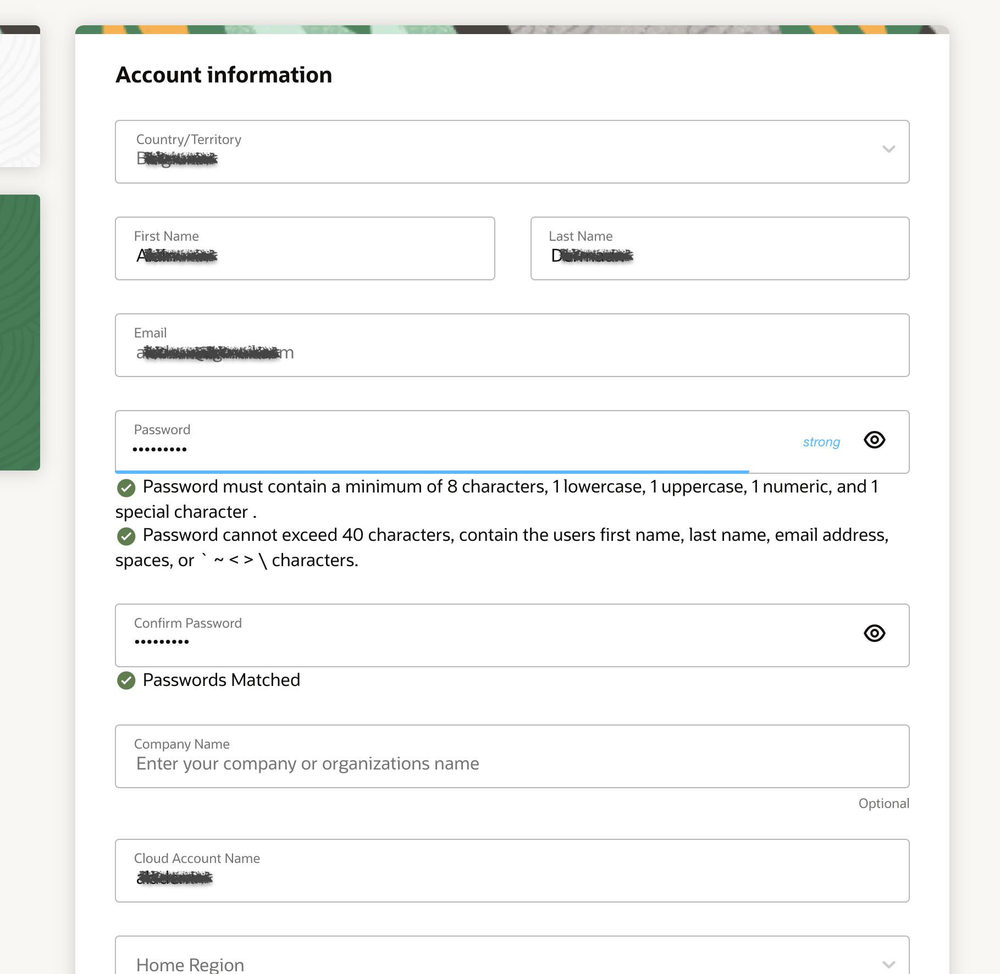
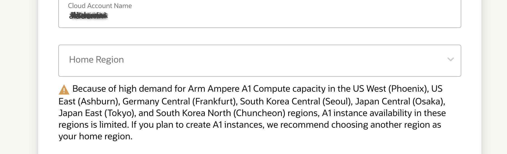

# Sign Up for Free OCI Trial

## Overview

This 5-minute lab walks you through the steps of getting an Oracle Cloud Free Tier account and signing in.  

### Two Cloud Offers in One

Oracle Cloud Free Tier allows you to sign up for an Oracle Cloud account which provides a number of Always Free services and a Free Trial with US$500 of free credit to use on all eligible Oracle Cloud Infrastructure services for up to 30 days. The Always Free services are available for an unlimited period of time. The Free Trial services may be used until your US$500 of free credits are consumed or the 30 days has expired, whichever comes first.

### Prerequisites

* A valid email address, make sure to use the address you have used to registered for this event!
* Ability to receive SMS text verification (only if your email isn't recognized!)

## Create Your Free Trial Account

In this section, you will sign-up for a free tier OCI account. Fill out the registration form [here](https://oracle.com/devlivejava0916).

💡 The sign-up user interface might be slightly different than the user interface shown in this guide. It is anyway very intuitive. The key is to sign-up using the **email address** used to register for this Hands-on-lab.

1.  Enter the appropriate information to create your account.
    * Select your **country/territory**.
    * Enter your first and last name.
    * Enter the **email address used to register** for this event. 
    * Confirm that you are a human 😉
    * Click **Verify my email**.

    

3.  If your email wasn't recognized or you're using a different email address, you will need to provide additional information.
    * Provide a mobile number and click **Next: Verify Mobile Number**. In a few seconds, you should receive a verification code through SMS-text. Enter this code in the appropriate field and click **Verify**.
    * Click **Add Credit Card Details**. You will NOT be charged unless you elect to upgrade the account later. Enter the billing information, card details, and click **Finish**.

4. Enter details for your new Oracle Cloud account.
    * You can choose almost anything for your **Cloud Account Name**. Make sure to write it down as you'll need it later to sign in.
    * Enter a secure password and verify it. Make sure to remember it so you can sign in later.	
	* You can optionally enter a company name.
	* Please read on before filling the Home Region field.

    

5. Select a Home Region

    

6. Click **Review Terms and Conditions**. Read and agree to the Terms & Conditions by checking the box and click **Complete Sign-Up**.

7. Your account is provisioning and should be available in a few seconds! When it's ready, you're automatically taken to a sign in page. You'll also receive a confirmation email containing sign in information.

##Sign in to Your Account

If you've signed out of the Oracle Cloud, use these steps to sign back in.

1. Go to [cloud.oracle.com](https://cloud.oracle.com).

    

2. Click **View Accounts** to bring up a menu.  Click **Sign in to Cloud**.

    

4. Enter your Cloud Account Name and click **Next**. This is the name you chose while creating your account in the previous section. It's NOT your email address. If you've forgotten the name, see the confirmation email.

    

5. Enter your Cloud Account credentials and click **Sign In**. Your username is your email address. The password is what you chose when you signed up for an account.

    

6. You are now signed in to Oracle Cloud!

  

You may now proceed to the next lab.

## Acknowledgements

- **Created By/Date** - Tom McGinn, Sr. Mgr, UA DB Development, March 2020
- **Last Updated By/Date** - David Delabassee, September 2021

